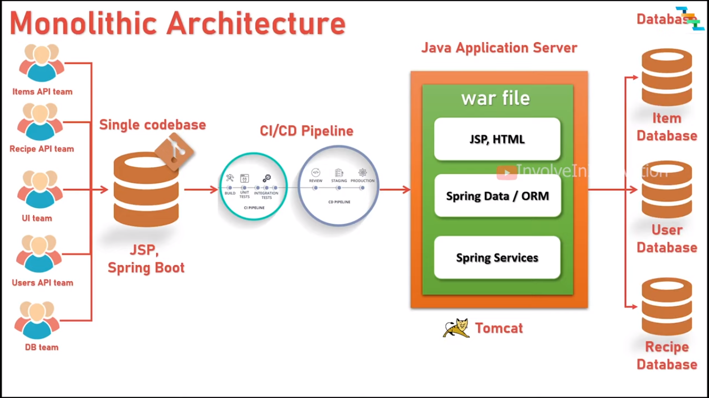
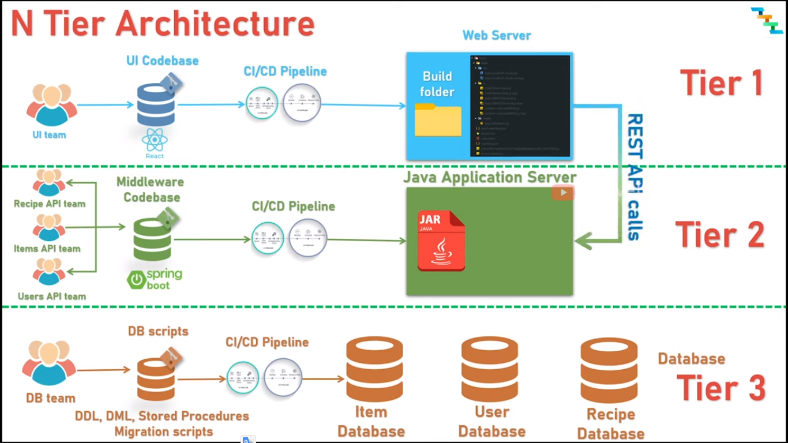
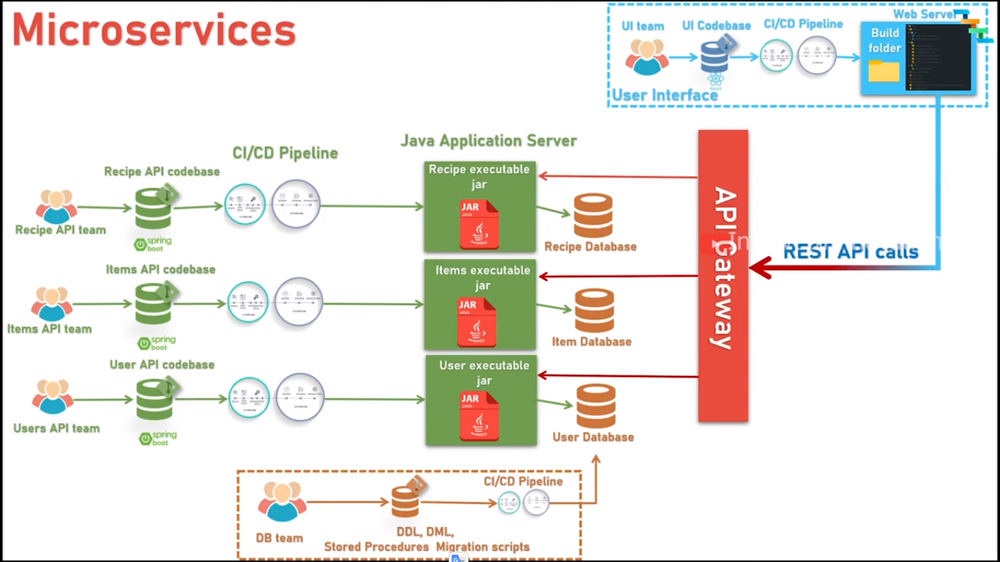

## Unidade 1: Introdução à Arquitetura de Sistemas Web (4 horas)

### 1.1. Conceitos básicos de arquitetura de sistemas web

Nesta seção, vamos estudar os conceitos básicos sobre arquitetura de sistemas web. Vamos aprender o que é arquitetura de software, quais são os modelos arquiteturais mais utilizados na indústria de software, quais são os principais desafios e tendências da arquitetura de sistemas web.

### 1.2 Definição

A __`arquitetura de aplicações web`__ descreve a estrutura interna e interações entre seus componentes. A estrutura descreve o relacionamento entre bases de dados, servidores e aplicações. As interações descrevem como os componentes se comunicam entre si.	

### 1.3. Modelos arquiteturais

Para o desenvolvimento de sistemas web, é fundamental que os desenvolvedores conheçam os modelos arquiteturais mais utilizados na indústria de software. Os modelos arquiteturais são padrões de arquitetura de software que definem a estrutura e o comportamento de um sistema de software. Os modelos arquiteturais são utilizados para facilitar o desenvolvimento de sistemas de software, pois eles definem a estrutura e o comportamento de um sistema de software.

#### 1.3.1. Arquitetura monolítica

A arquitetura monolítica é um padrão tradicional de arquitetura de software no qual a aplicação é implantada como uma única unidade totalmente integrada. A aplicação é implantada como __`uma única e grande base de código`__ que contém todas as funcionalidades.

A figura abaixo ilustra a arquitetura monolítica:

**Fonte:** [Monolithic, N-Tier, Microservices explained with comparison and example - Software Architecture](https://www.youtube.com/watch?app=desktop&v=qbDkBPpmjJM)

As principais características de uma arquitetura monolítica são:

- __`Acoplamento forte`__: a aplicação é uma única unidade totalmente integrada, o que significa que qualquer alteração em um componente pode afetar outros componentes da aplicação.
- __`Escalabilidade limitada`__: a aplicação é implantada como uma única unidade, o que significa que todos os componentes da aplicação devem ser escalados juntos.
- __`Implantação única`__: a aplicação é implantada como uma única unidade, o que significa que todos os componentes da aplicação devem ser implantados juntos.
- __`Tecnologias limitadas`__: a aplicação é uma única unidade totalmente integrada, o que significa que todos os componentes da aplicação devem ser desenvolvidos usando a mesma linguagem de programação e tecnologias.
- __`Ciclo de vida limitado`__: a aplicação é uma única unidade totalmente integrada, o que significa que todos os componentes da aplicação devem ser desenvolvidos usando a mesma linguagem de programação e tecnologias.

Essas características acima podem ser consideradas como **desvantagens** de uma arquitetura monolítica. Contudo, a aplicação é uma única unidade totalmente integrada, o que significa que todos os componentes da aplicação são desenvolvidos usando a mesma linguagem de programação e tecnologias. Isso pode ser considerado como uma **vantagem** de uma arquitetura monolítica porque __`facilita o desenvolvimento, implantação, manutenção, testes e depuração da aplicação.`__

Para demonstrar, vamos criar uma aplicação web com Python e Flask. Para isso, vamos seguir os seguintes passos descritos no [01-exemplo-monolito.md](01-exemplo-monolito.md). 

#### 1.3.2. Arquitetura em N camadas (N-tier)

A arquitetura em N camadas é um padrão tradicional de arquitetura de software no qual a aplicação é dividida em camadas lógicas ou físicas. Cada camada é responsável por uma funcionalidade específica. A camada de apresentação é responsável por apresentar a interface do usuário. A camada de negócios é responsável por implementar as regras de negócio. A camada de dados é responsável por armazenar e recuperar os dados.

A figura abaixo ilustra a arquitetura em N camadas:

**Fonte:** [Monolithic, N-Tier, Microservices explained with comparison and example - Software Architecture](https://www.youtube.com/watch?app=desktop&v=qbDkBPpmjJM)

As principais características de uma arquitetura em N camadas são:

- __`Acoplamento fraco`__: as camadas são independentes, o que significa que uma alteração em uma camada não afeta outras camadas. Por exemplo, uma alteração na camada de apresentação não afeta a camada de negócios.
- __`Modularidade`__: as camadas são independentes, o que significa que uma camada pode ser substituída por outra camada. Por exemplo, a camada de apresentação pode ser substituída por uma camada de serviços web.
- __`Manutenabilidade`__: a separação de responsabilidades e a modularidade facilitam a manutenção do sistema. As alterações podem ser feitas em uma camada sem afetar outras partes do sistema. 
- __`Escalabilidade`__: pode-se adicionar ou remover camadas conforme necessário para atender aos requisitos específicos do sistema. Por exemplo, pode-se adicionar uma camada de cache para melhorar o desempenho do sistema.
- __`Tecnologias`__: as camadas são independentes, o que significa que cada camada pode ser desenvolvida usando uma linguagem de programação e tecnologias diferentes. Por exemplo, a camada de apresentação pode ser desenvolvida usando HTML, CSS e JavaScript, enquanto a camada de negócios pode ser desenvolvida usando Java e a camada de dados pode ser desenvolvida usando SQL.
- __`Padrões de Comunicação`__: O acesso entre camadas geralmente segue padrões bem definidos, como chamadas de método, troca de mensagens ou serviços web, dependendo do contexto.

Um exemplo típico de arquitetura em N camadas é a arquitetura MVC (Model-View-Controller). A arquitetura MVC é um padrão de arquitetura de software que separa a aplicação em três camadas: 
 - Camada de apresentação (View): apresentar a interface do usuário.
 - Camada de negócios (Controller): implementar as regras de negócio.
 - Camada de dados (Model). armazenar e recuperar os dados.

#### 1.3.3. Arquitetura de microserviços (Microservices)

A arquitetura de microsserviços é um padrão moderno de arquitetura de software no qual a aplicação é dividida em serviços pequenos, independentes e com baixo acoplamento. Cada serviço é uma base de código separada, que pode ser mantida por uma pequena equipe de desenvolvimento. Essa abordagem tem diversas características que podem oferecer benefícios em termos de escalabilidade, manutenção, flexibilidade e implementação de soluções distribuídas.

A figura abaixo ilustra a arquitetura de microsserviços:

**Fonte:** [Monolithic, N-Tier, Microservices explained with comparison and example - Software Architecture](https://www.youtube.com/watch?app=desktop&v=qbDkBPpmjJM)

Para demonstrar a arquitetura de microsserviços, vamos criar uma aplicação web com Python e Flask. Para isso, vamos seguir os seguintes passos descritos no [01-exemplo-microservicos.md](01-exemplo-microservicos.md).