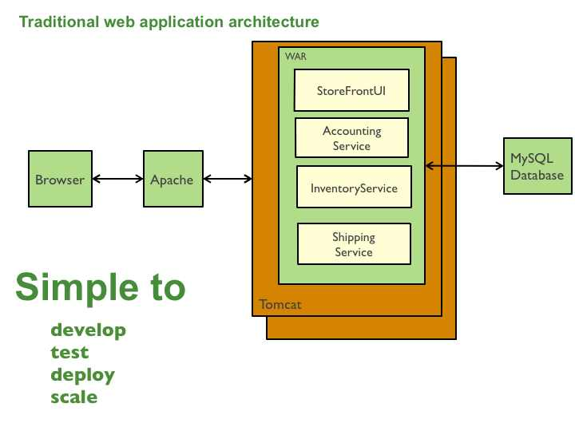
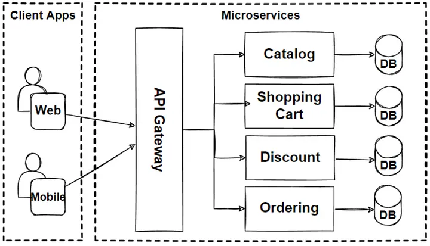

## Unidade 1: Introdução à Arquitetura de Sistemas Web (4 horas)

### 1.1. Conceitos básicos de arquitetura de sistemas web

Nesta seção, vamos estudar os conceitos básicos sobre arquitetura de sistemas web. Vamos aprender o que é arquitetura de software, quais são os modelos arquiteturais mais utilizados na indústria de software, quais são os principais desafios e tendências da arquitetura de sistemas web.

### 1.2 Definição

A __`arquitetura de aplicações web`__ descreve a estrutura interna e interações entre seus componentes. A estrutura é composta de elementos de software, das propriedades externamente visíveis desses elementos, e dos relacionamentos entre eles.

  - **Componentes**: partes que compõem a aplicação web. Exemplos: cliente, servidor, banco de dados, etc.
  - **Conectores**: mecanismos que permitem a comunicação entre os componentes. Exemplos: protocolos de comunicação, APIs, etc.
 - **Restrições**: regras que definem como os componentes e conectores podem interagir. Exemplos: autenticação, autorização, etc.
	

### 1.3. Modelos arquiteturais

Para o desenvolvimento de sistemas web, é fundamental que os desenvolvedores conheçam os modelos arquiteturais mais utilizados na indústria de software. Os modelos arquiteturais são padrões de arquitetura de software que definem a estrutura e o comportamento de um sistema de software. Os modelos arquiteturais são utilizados para facilitar o desenvolvimento de sistemas de software, pois eles definem a estrutura e o comportamento de um sistema de software.

#### 1.3.1. Arquitetura monolítica

A arquitetura monolítica é um padrão de arquitetura de software no qual a aplicação é implantada como uma única unidade totalmente integrada. A aplicação é implantada como __`uma única e grande base de código`__ que contém todas as funcionalidades.

A figura abaixo ilustra a arquitetura monolítica:



As principais características de uma arquitetura monolítica são:

- __`Acoplamento forte`__: a aplicação é uma única unidade totalmente integrada, o que significa que qualquer alteração em um componente pode afetar outros componentes da aplicação.
- __`Escalabilidade limitada`__: a aplicação é implantada como uma única unidade, o que significa que todos os componentes da aplicação devem ser escalados juntos.
- __`Implantação única`__: a aplicação é implantada como uma única unidade, o que significa que todos os componentes da aplicação devem ser implantados juntos.
- __`Tecnologias limitadas`__: a aplicação é uma única unidade totalmente integrada, o que significa que todos os componentes da aplicação devem ser desenvolvidos usando a mesma linguagem de programação e tecnologias.
- __`Ciclo de vida limitado`__: a aplicação é uma única unidade totalmente integrada, o que significa que todos os componentes da aplicação devem ser desenvolvidos usando a mesma linguagem de programação e tecnologias.

Essas características acima podem ser consideradas como **desvantagens** de uma arquitetura monolítica. Contudo, a aplicação é uma única unidade totalmente integrada, o que significa que todos os componentes da aplicação são desenvolvidos usando a mesma linguagem de programação e tecnologias. Isso pode ser considerado como uma **vantagem** de uma arquitetura monolítica porque __`facilita o desenvolvimento, implantação, manutenção, testes e depuração da aplicação.`__

Para demonstrar, vamos criar uma aplicação web com Python e Flask. Para isso, vamos seguir os seguintes passos:

0. Criação do ambiente virtual:

```bash
$ python -m venv .venv
$ source .venv/bin/activate
```

1. Instalação das dependências:

```bash
$ pip install --upgrade pip
$ pip install flask
```

2. Criação do arquivo `app.py`:

```bash
$ touch app.py
```

Adicionem o seguinte código no arquivo `app.py`:

```python
from flask import Flask, render_template, request, redirect, url_for

app = Flask(__name__)

# Lista de tarefas (poderia ser substituída por um banco de dados em um aplicativo real)
tasks = []

@app.route('/')
def index():
    return render_template('index.html', tasks=tasks)

@app.route('/add', methods=['POST'])
def add():
    task = request.form.get('task')
    if task:
        tasks.append(task)
    return redirect(url_for('index'))

@app.route('/delete/<int:task_id>')
def delete(task_id):
    if 0 <= task_id < len(tasks):
        del tasks[task_id]
    return redirect(url_for('index'))

if __name__ == '__main__':
    app.run(debug=True)
```

3. Criação do arquivo `templates/index.html`:

```bash
$ mkdir templates
$ touch templates/index.html
```

Adicionem o seguinte código no arquivo `templates/index.html`:

```html
<!DOCTYPE html>
<html lang="en">
<head>
    <meta charset="UTF-8">
    <meta name="viewport" content="width=device-width, initial-scale=1.0">
    <title>Lista de Tarefas</title>
</head>
<body>
    <h1>Lista de Tarefas</h1>
    <ul>
        
            <li>{{ task }} <a href="{{ url_for('delete', task_id=loop.index-1) }}">[X]</a></li>
        
    </ul>
    <form action="{{ url_for('add') }}" method="post">
        <label for="task">Nova Tarefa:</label>
        <input type="text" name="task" required>
        <button type="submit">Adicionar</button>
    </form>
</body>
</html>
```

1. Execução da aplicação:

```bash
$ python app.py
```

5. Acesse a aplicação no navegador:

```bash
http://localhost:5000
```

Podemos também executar a aplicação com o `gunicorn`. Essa é uma boa prática para a implantação de aplicações web em produção. O gunicorn é um servidor HTTP WSGI para Python. O WSGI é um padrão de interface entre servidores e aplicações web para a linguagem de programação Python. Para executar a aplicação com o `gunicorn`, vamos seguir os seguintes passos:

6. Instalando o `gunicorn`:

```bash
$ pip install gunicorn
```

7. Executando a aplicação com o `gunicorn`:

```bash
$ gunicorn app:app
```

8. Acesse a aplicação no navegador:

```bash
http://localhost:8000
```

Agora, vamos configurar o `nginx` como um proxy reverso para o `gunicorn`. O nginx é um servidor HTTP e proxy reverso, bem como um servidor de proxy de e-mail. Para configurar o `nginx`, vamos seguir os seguintes passos:

9. Instalando o `nginx`:

```bash
$ sudo apt install nginx # Ubuntu/Debian
$ sudo yum install nginx # CentOS/RHEL
$ sudo pacman -S nginx # Arch Linux
```

10. Configurando o `nginx` no Ubuntu:
    
```bash
$ sudo rm /etc/nginx/sites-enabled/default
$ sudo touch /etc/nginx/sites-available/flask
$ sudo ln -s /etc/nginx/sites-available/flask /etc/nginx/sites-enabled/flask
```

11. Adicionem o seguinte código no arquivo `/etc/nginx/sites-available/flask`:

```bash
server {
    listen 80;
    server_name localhost monolito.ifc.edu.br;

    location / {
        proxy_pass http://localhost:8000;
    }
}
```

12. Alterando o arquivo `/etc/hosts`:

```bash
$ sudo nano /etc/hosts
```

Altere a seguinte linha no arquivo `/etc/hosts`:

```bash
127.0.0.1 localhost monolito.ifc.edu.br
```

13. Reiniciando o `nginx`:

```bash
$ sudo nginx -t # Testa a configuração do nginx
$ sudo systemctl restart nginx
```

14. Rodar a aplicação com o `gunicorn`:

```bash
$ gunicorn app:app
```

15. Acesse a aplicação no navegador:

```bash
http://monolito.ifc.edu.br
```

<!-- 

#### 1.3.2. Arquitetura de camadas

#### 1.3.2. Arquitetura de microsserviços

Os microsserviços são __`serviços pequenos, independentes e com baixo acoplamento`__. Assim, os microsserviços podem trabalhar em conjunto e podem ser implantados de forma independente e autónoma. Cada serviço é uma base de código separada, que pode ser gerida por uma pequena equipa de desenvolvimento. Uma única pequena equipa de programadores pode escrever e manter um determinado microsserviço.

A figura abaixo ilustra a arquitetura de microsserviços:



### 1.3. Principais desafios e tendências -->