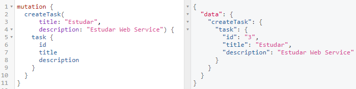
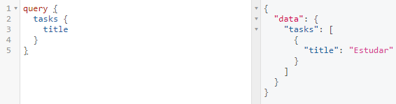

# Desenvolvimento Web II
## Aula 06 - GraphQL: Linguagem de Consulta para APIs

**Professor**: Fabricio Bizotto  
**Instituição**: Instituto Federal Catarinense - IFC
**Email**: fabricio.bizotto@ifc.edu.br  
**Data**: 29 de Abril, 2025  
**Curso**: Ciência da Computação

---

## Roteiro
- GraphQL
- Componentes do GraphQL
- Implementação
- Padrões e Boas Práticas
- Casos de Uso e Ecossistema
- Experimentos

---

## GraphQL: Definição
**GraphQL - Graph Query Language**
- Linguagem de consulta para APIs.
- Criada pelo Facebook em 2012, open-source desde 2015.
- Alternativa ao REST, permite solicitações flexíveis de dados.
- Fornece descrição completa e compreensível dos dados, facilitando evolução das APIs.

---

## GraphQL: Por que foi criado?
**Origem e Motivação**
- Criado pelo Facebook para resolver problemas no desenvolvimento de aplicativos móveis.
- Em 2012, necessidade de solução eficiente para consulta de dados no app móvel.
- **Problemas com REST**:
  - *Múltiplas requisições* para dados relacionados.
  - *Overfetching* (excesso de dados).
  - *Underfetching* (falta de dados).
  - Dificuldade em evoluir APIs sem quebrar clientes.
- Open-source em 2015, permitindo contribuições da comunidade.

---

## GraphQL: Características
- **Consulta única**: Recupera apenas dados necessários.
- **Tipagem forte**: Define estrutura dos dados.
- **Introspecção**: Permite consultar a estrutura da API.
- **Múltiplas operações**: Vários recursos em uma solicitação.
- **Documentação embutida**: Descrição completa dos dados.
- **Validação de consulta**: Valida consultas antes da execução.

---

## GraphQL: Estrutura


---

## GraphQL: Fluxo de Dados Detalhado
```mermaid
graph LR
    A[Cliente<br><small>(Frontend)</small>] -->|1. Consulta| B[Servidor<br><small>GraphQL</small>]
    B -->|2. Análise| C[Resolvers]
    C -->|3. Execução| D[Fontes de Dados]
    D -->|4. Resultados| C
    C -->|5. Resposta| B
    B -->|6. JSON| A
```
- Cliente envia consulta GraphQL específica.
- Servidor analisa e valida com base no schema.
- Resolvers coletam dados de fontes (BD, APIs, etc.).
- Resultados formatados conforme a consulta.
- Cliente recebe apenas dados solicitados.

---

## GraphQL: Comparação com REST
| **REST** | **GraphQL** |
|----------|-------------|
| Arquitetura | Linguagem de consulta |
| Dados como recursos | Dados como grafo |
| Overfetching/underfetching comuns | Solicita apenas dados necessários |
| Múltiplos endpoints | Único ponto de entrada |
| Endpoints separados para escrita | Mutações no mesmo endpoint |
| Diversos métodos HTTP | Usa POST (qualquer protocolo) |
| Pode exigir versionamento | Não requer versionamento |

---

## GraphQL: Quando usar GraphQL vs REST
**Considere GraphQL quando:**
- Interfaces precisam de dados personalizados.
- Frontend com múltiplas visualizações.
- Aplicações móveis (economia de banda).
- Dados altamente relacionais.
- APIs consumidas por times diferentes.

**Considere REST quando:**
- Recursos simples com poucos relacionamentos.
- Cache HTTP essencial.
- Equipe familiarizada com REST.
- APIs públicas com consumidores desconhecidos.
- Operações com upload de arquivos.

**Melhor dos dois mundos**: Use *ambos* na mesma aplicação.

---

# Componentes do GraphQL

## Schema e Type System
**Schema**: Define estrutura dos dados e operações:
- **Types**: Estrutura dos objetos.
- **Fields**: Propriedades de um tipo.
- **Queries**: Operações de leitura.
- **Mutations**: Operações de escrita.
- **Subscriptions**: Operações em tempo real (WebSockets).

```graphql
type Person {
  id: ID!
  name: String!
  age: Int
  friends: [Person]
  posts: [Post]
}

type Post {
  id: ID!
  title: String!
  content: String!
  author: Person!
}
```

---

## Tipos Escalares e Personalizados
**Tipos Escalares Padrão**:
- `Int`: Inteiro de 32 bits.
- `Float`: Número decimal.
- `String`: Sequência UTF-8.
- `Boolean`: `true` ou `false`.
- `ID`: Identificador único (serializado como String).

**Tipos Personalizados**:
- **Enums**:
  ```graphql
  enum UserRole {
    ADMIN
    EDITOR
    VIEWER
  }
  ```
- **Input Types**:
  ```graphql
  input CreateUserInput {
    name: String!
    email: String!
    role: UserRole
  }
  ```

---

## Definição de Schema Completo
```graphql
# Tipos
type User {
  id: ID!
  name: String!
  email: String!
  posts: [Post!]
}

type Post {
  id: ID!
  title: String!
  content: String
  author: User!
}

# Inputs
input CreatePostInput {
  title: String!
  content: String
}

# Queries
type Query {
  users: [User!]!
  user(id: ID!): User
  posts: [Post!]!
  post(id: ID!): Post
}

# Mutations
type Mutation {
  createUser(name: String!, email: String!): User!
  createPost(userId: ID!, input: CreatePostInput!): Post!
  deletePost(id: ID!): Boolean!
}
```

---

## Mutation
**Mutation**: Operação para *criar, atualizar ou excluir dados*.
- Semelhante a escrita no REST.
- Tratada no mesmo endpoint que consultas.



---

## Exemplo de Mutation Avançada
```graphql
# Schema
type Mutation {
  createUser(input: CreateUserInput!): UserPayload!
  updateUser(id: ID!, input: UpdateUserInput!): UserPayload!
  deleteUser(id: ID!): DeleteUserPayload!
}

input CreateUserInput {
  name: String!
  email: String!
  role: UserRole = VIEWER
}

type UserPayload {
  user: User
  errors: [Error!]
}

type DeleteUserPayload {
  success: Boolean!
  errors: [Error!]
}

# Exemplo de uso
mutation {
  createUser(input: {
    name: "João Silva",
    email: "joao@example.com",
    role: EDITOR
  }) {
    user {
      id
      name
    }
    errors {
      message
      path
    }
  }
}
```

---

## Query
**Query**: Operação para *recuperar dados*.
- Semelhante a leitura no REST.
- Tratada no mesmo endpoint que mutações.



---

## Exemplos de Queries Avançadas
```graphql
# Query com argumentos, aliases e fragments
query GetUserDetails($userId: ID!, $withPosts: Boolean = true) {
  user(id: $userId) {
    id
    name
    email
    ...UserRoleInfo
    postsInfo: posts @include(if: $withPosts) {
      count
      edges {
        node {
          id
          title
        }
      }
    }
  }
}

fragment UserRoleInfo on User {
  role
  permissions
}
```

**Recursos Avançados**:
- **Variables** (`$userId`): Parâmetros dinâmicos.
- **Aliases** (`postsInfo`): Renomear campos.
- **Fragments**: Reutilizar campos.
- **Directives** (`@include`): Modificar execução.

---

## Subscription
**Subscription**: Operação para *atualizações em tempo real*.
- Usa WebSockets para notificações.
- Ideal para chats, notificações, etc.

```graphql
# Schema
type Subscription {
  newPost: Post!
  userStatusChanged(userId: ID!): UserStatus!
  notificationReceived: Notification!
}

# Exemplo de uso
subscription {
  newPost {
    id
    title
    author {
      name
    }
  }
}
```

---

# Implementação

## Ferramentas e Bibliotecas
**Backend**:
- **JavaScript/Node.js**:
  - `graphql-js`: Implementação de referência.
  - `Apollo Server`: Framework completo.
  - `Express GraphQL`: Middleware para Express.
  - `TypeGraphQL`: Framework com TypeScript.
- **Python**:
  - `Graphene`: Framework para Python.
  - `Strawberry`: Framework baseado em tipos.

**Frontend**:
- **JavaScript/React**:
  - `Apollo Client`: Cliente completo.
  - `Relay`: Framework do Facebook.
  - `urql`: Alternativa leve.
- **Ferramentas**:
  - `GraphiQL`: IDE para explorar APIs.
  - `Apollo Studio`: Plataforma de gerenciamento.
  - `GraphQL Playground`: IDE alternativa.

---

## Implementação Express + GraphQL
```javascript
// npm install express express-graphql graphql
const express = require('express');
const { graphqlHTTP } = require('express-graphql');
const { buildSchema } = require('graphql');

// Schema
const schema = buildSchema(`
  type Query {
    hello: String
    user(id: ID!): User
  }
  type User {
    id: ID!
    name: String!
    email: String
  }
`);

// Resolvers
const root = {
  hello: () => 'Hello world!',
  user: ({ id }) => {
    return { id, name: 'Usuário ' + id, email: 'user' + id + '@example.com' };
  }
};

// Express server
const app = express();
app.use('/graphql', graphqlHTTP({
  schema,
  rootValue: root,
  graphiql: true,
}));
app.listen(4000, () => {
  console.log('GraphQL server running at http://localhost:4000/graphql');
});
```

---

## Implementação Apollo Server
```javascript
// npm install @apollo/server graphql
const { ApolloServer } = require('@apollo/server');
const { startStandaloneServer } = require('@apollo/server/standalone');

// Schema
const typeDefs = `#graphql
  type Query {
    hello: String
    users: [User!]!
    user(id: ID!): User
  }
  type User {
    id: ID!
    name: String!
    email: String
    posts: [Post!]
  }
  type Post {
    id: ID!
    title: String!
    content: String
    author: User!
  }
`;

// Mock database
const users = [
  { id: '1', name: 'Alice', email: 'alice@example.com' },
  { id: '2', name: 'Bob', email: 'bob@example.com' }
];
const posts = [
  { id: '1', title: 'GraphQL Basics', content: 'This is about GraphQL...', authorId: '1' },
  { id: '2', title: 'Apollo Server', content: 'Apollo makes GraphQL easy...', authorId: '1' },
  { id: '3', title: 'REST vs GraphQL', content: 'Comparing the two...', authorId: '2' }
];

// Resolvers
const resolvers = {
  Query: {
    hello: () => 'Hello world!',
    users: () => users,
    user: (_, { id }) => users.find(user => user.id === id)
  },
  User: {
    posts: (parent) => posts.filter(post => post.authorId === parent.id)
  },
  Post: {
    author: (parent) => users.find(user => user.id === parent.authorId)
  }
};

// Server
const server = new ApolloServer({ typeDefs, resolvers });
async function startServer() {
  const { url } = await startStandaloneServer(server, { listen: { port: 4000 } });
  console.log(`🚀 Server ready at ${url}`);
}
startServer();
```

---

## Cliente Apollo React
```jsx
// npm install @apollo/client graphql
import React from 'react';
import { ApolloClient, InMemoryCache, ApolloProvider, useQuery, gql } from '@apollo/client';

// Cliente Apollo
const client = new ApolloClient({
  uri: 'http://localhost:4000/graphql',
  cache: new InMemoryCache()
});

// Query
const GET_USERS = gql`
  query GetUsers {
    users {
      id
      name
      posts {
        id
        title
      }
    }
  }
`;

// Componente
function UsersList() {
  const { loading, error, data } = useQuery(GET_USERS);
  if (loading) return <p>Carregando...</p>;
  if (error) return <p>Erro: {error.message}</p>;
  return (
    <div>
      <h2>Usuários</h2>
      <ul>
        {data.users.map(user => (
          <li key={user.id}>
            <h3>{user.name}</h3>
            <p>Posts:</p>
            <ul>
              {user.posts.map(post => (
                <li key={post.id}>{post.title}</li>
              ))}
            </ul>
          </li>
        ))}
      </ul>
    </div>
  );
}

// App
function App() {
  return (
    <ApolloProvider client={client}>
      <div className="App">
        <h1>Minha Aplicação GraphQL</h1>
        <UsersList />
      </div>
    </ApolloProvider>
  );
}
export default App;
```

---

## GraphiQL e Ferramentas de Exploração
**GraphiQL**:
- IDE interativa para explorar APIs GraphQL.
- Autocomplete, documentação integrada, validação.
- Exploração visual do schema.
- Histórico de consultas.

---

## Apollo Studio

- Interface moderna.
- Gerenciamento de operações.
- Analytics e métricas.
- Colaboração em equipe.
- Versionamento de schema.

---

# Padrões e Boas Práticas

## Design de Schema
**Boas Práticas**:
- **Nomes descritivos**: Clareza e consistência.
- **Tipos não-nulos**: Use `!` para campos obrigatórios.
- **IDs consistentes**: Use tipo `ID`.
- **Paginação**: Para listas grandes.
- **Mutations padronizadas**: Padrão de entrada/saída.
- **Erros tipados**: Retorne erros estruturados.

```graphql
# Paginação
type Query {
  users(first: Int!, after: String): UserConnection!
}
type UserConnection {
  edges: [UserEdge!]!
  pageInfo: PageInfo!
}
type UserEdge {
  node: User!
  cursor: String!
}
type PageInfo {
  hasNextPage: Boolean!
  endCursor: String
}
```

---

## Manipulação de Erros
**Tipos de Erros**:
1. **Erros de Sintaxe**: Estrutura inválida.
2. **Erros de Validação**: Consulta não permitida.
3. **Erros de Resolução**: Durante execução dos resolvers.

```json
{
  "errors": [
    {
      "message": "Cannot query field 'age' on type 'User'",
      "locations": [{ "line": 3, "column": 5 }],
      "path": ["user", "age"]
    }
  ],
  "data": {
    "user": {
      "name": "John"
    }
  }
}
```

**Padrão de Erros**:
```graphql
type Error {
  message: String!
  path: [String!]
  code: ErrorCode!
}
enum ErrorCode {
  NOT_FOUND
  UNAUTHORIZED
  VALIDATION_ERROR
  INTERNAL_ERROR
}
type UserPayload {
  user: User
  errors: [Error!]
}
```

**Benefícios**:
- Erros tipados e estruturados.
- Cliente lida com erros específicos.
- Respostas parciais com dados + erros.

---

## Performance e Cache
**Desafios**:
- **N+1 Problema**: Consultas aninhadas causam múltiplas chamadas.
- **Consultas complexas**: Clientes podem criar queries pesadas.
- **Limitação de profundidade**: Relacionamentos profundos.
- **Cache**: Mais desafiador que REST.

**Soluções**:
- **DataLoader**: Batching e caching.
- **Limitação de Consulta**: Restringir complexidade/profundidade.
- **Persisted Queries**: Usar hashes para queries fixas.
- **APQ**: Automatic Persisted Queries (Apollo).
- **CDN Caching**: Para queries frequentes.

---

## Segurança
**Considerações**:
- **Validação de Entrada**: Validar todos os inputs.
- **Limitação de Recursos**: Prevenir queries complexas.
- **Autenticação/Autorização**: Camada própria ou directives.
- **Proteção contra Intrusão**: Evitar exposição de erros.
- **Rate Limiting**: Limitar requisições por cliente.

```graphql
# Exemplo com directive
type Query {
  publicData: String
  privateData: String @requiresAuth
  adminData: String @requiresRole(role: ADMIN)
}
directive @requiresAuth on FIELD_DEFINITION
directive @requiresRole(role: Role!) on FIELD_DEFINITION
enum Role {
  USER
  EDITOR
  ADMIN
}
```

---

# Casos de Uso e Ecossistema

## Quem usa GraphQL?
**Empresas Globais**:
- Meta/Facebook (criador).
- GitHub (API v4).
- Shopify (e-commerce).
- Twitter, PayPal, Netflix, Airbnb, The New York Times.

**Empresas Brasileiras**:
- Globo.com, Nubank, Vtex, AmeDigital, Pagar.me, Conta Azul, Loggi, Ifood.

[Repositório de empresas brasileiras usando GraphQL](https://github.com/graphql-brasil/empresas-que-usam-graphql-no-brasil)

---

## Por que essas empresas adotaram GraphQL?
**Benefícios Técnicos**:
- **Eficiência de Rede**: Menos chamadas, dados exatos.
- **Desenvolvimento Frontend Acelerado**: Independência do backend.
- **Evolução sem Quebras**: Adição de campos sem versionar.
- **Documentação e Introspecção**: Self-documenting.
- **Substituição gradual**: Convive com REST.

**Benefícios de Negócio**:
- **Desenvolvimento Rápido**: Menos tempo em endpoints.
- **UX Melhorada**: Apps responsivos.
- **Menor Custo de Manutenção**: API flexível.
- **Melhor Colaboração**: Equipes independentes.
- **Consistência**: Uma linguagem para dados.

**Case Study**: GitHub migrou para GraphQL, reduzindo respostas em 10x e acelerando desenvolvimento.

---

## APIs GraphQL Públicas para Aprendizado
- [Pokémon API](https://graphqlpokemon.favware.tech/v8): Dados sobre Pokémon.
- [Countries API](https://countries.trevorblades.com/): Países, continentes, idiomas.
- [Rick and Morty API](https://rickandmortyapi.com/graphql): Personagens, episódios.
- [SpaceX API](https://api.spacex.land/graphql/): Lançamentos e foguetes.
- [GraphQLZero](https://graphqlzero.almansi.me/): API de teste.
- [Lista de APIs](https://github.com/APIs-guru/graphql-apis): Coleção de APIs públicas.

**Sandbox GraphQL**: Use [Apollo Sandbox](https://studio.apollographql.com/sandbox/explorer) para testar APIs.

---

## Material Complementar
**Recursos**:
- [Documentação Oficial](https://graphql.org/)
- [GraphQL: APIs for humans](https://graphql.com/)
- [Apollo GraphQL](https://www.apollographql.com/docs/)
- [How to GraphQL](https://www.howtographql.com/)
- [GraphQL Code Generator](https://www.graphql-code-generator.com/)
- [Especificação GraphQL](https://graphql.github.io/graphql-spec/)
- [GraphQL Foundation](https://foundation.graphql.org/)

**Livros e Cursos**:
- [GraphQL in Action (Manning)](https://www.manning.com/books/graphql-in-action)
- [The Modern GraphQL Bootcamp (Udemy)](https://www.udemy.com/course/graphql-bootcamp/)

---

## Experimentos

### Experimento 1
- Consultar [Pokémon API](https://graphqlpokemon.favware.tech/v8).
- Navegar pela documentação e testar recursos.
- Criar consultas:
  - Buscar Pokémon por nome (tipos e habilidades).
  - Buscar movimentos de um tipo específico.
  - Usar fragments para reutilizar campos.

### Experimento 2
- Implementar aplicação frontend consultando API GraphQL.
- Escolher framework (React, Vue, Angular, Python, VanillaJS, etc.).
- APIs sugeridas:
  - [Pokémon API](https://github.com/favware/graphql-pokemon)
  - [Countries API](https://github.com/trevorblades/countries)
  - [Rick and Morty API](https://rickandmortyapi.com/documentation)
  - [SpaceX API](https://studio.apollographql.com/public/SpaceX-pxxbxen/variant/current/home)
  - [GraphQLZero](https://graphqlzero.almansi.me/)
  - Ou outra API GraphQL.

---

### Experimento 3 - Mini Projeto
**Desafio**: Construir um backend GraphQL.
1. Criar servidor com:
   - Node.js + Apollo Server, ou
   - Node.js + express-graphql, ou
   - Python + Graphene.
2. Implementar schema com 3 tipos relacionados.
3. Criar operações de Query.
4. Criar operações de Mutation (criar/atualizar/excluir).
5. Implementar validações e tratamento de erros.
6. Documentar a API.

**Dica**: Comece com arrays em memória, depois use SQLite, MongoDB ou outra persistência.

---

## Discussão
**Perguntas para Reflexão**:
1. Quando GraphQL é superior ao REST?
2. Quando REST é melhor?
3. Como GraphQL afeta a separação frontend/backend?
4. Quais desafios de segurança do GraphQL e como mitigá-los?
5. Como migrar gradualmente de REST para GraphQL?
6. GraphQL substitui ou complementa REST?