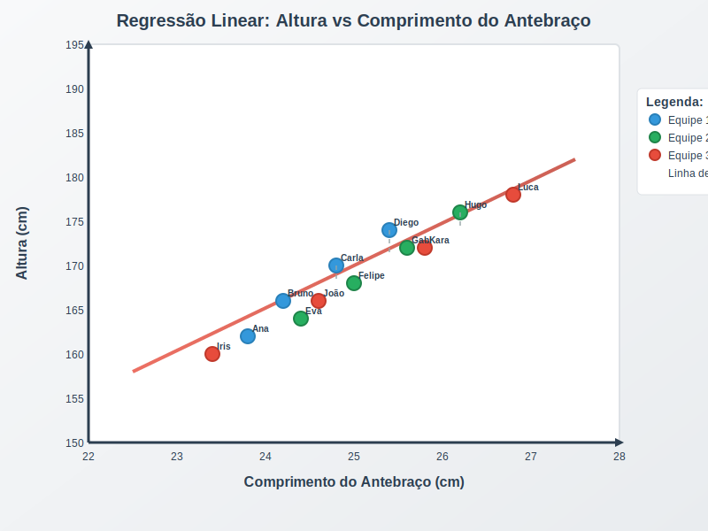

## Dinâmica de Grupo: Introdução à Modelagem Preditiva com Regressão Linear (Versão com Gráficos por Equipe)

Ensinar os participantes a identificar padrões entre variáveis, compreender a ideia de previsão com base em modelos e exercitar a construção de gráficos e linhas de tendência, **cada equipe de forma autônoma**.

### **1. Materiais Necessários**

* **Fitas métricas**: Para medir o comprimento do antebraço.
* **Cartolinas ou folhas grandes de papel**: Cada equipe usará uma para criar seu gráfico.
* **Marcadores coloridos e post-its**: Para registrar e distinguir os pontos de dados.
* **Fita adesiva e barbante**: Para criar a "linha de melhor ajuste".
* **Réguas grandes e pranchetas**: Para medir e desenhar.

### **2. Preparação**

* Dividir os participantes em **equipes de 4 a 5 pessoas**.
* Cada equipe recebe o seu **kit de materiais**.
* O facilitador orienta sobre como desenhar um **plano cartesiano simples** em sua cartolina:

  * **Eixo X**: Comprimento do antebraço (cm).
  * **Eixo Y**: Altura da pessoa (cm).

### **3. Parte 1: Coleta de Dados (20 minutos)**

Cada equipe mede o comprimento do antebraço e a altura de pelo menos **10 participantes** (podem ser da própria equipe ou incluir colegas de outras equipes).
Os dados são registrados em uma **planilha ou tabela**.

### **4. Parte 2: Construção e Visualização dos Gráficos (20 minutos)**

* As equipes desenham o plano cartesiano na cartolina.
* Plotam os **pontos correspondentes aos dados coletados** usando marcadores ou post-its.
* Observam e discutem visualmente: há um padrão? Os pontos estão próximos de uma linha?

### **5. Parte 3: Modelagem Visual de Regressão Linear (15 minutos)**

* Cada equipe posiciona um **barbante ou traça uma linha** que, na percepção do grupo, **melhor representa a tendência** dos dados.
* O facilitador explica que, na prática, modelos matemáticos buscam minimizar os erros, mas que nesta atividade o ajuste será **feito apenas com base na intuição visual**.

### **6. Parte 4: Teste Cruzado dos Modelos (15 minutos)**

* As equipes **trocariam seus gráficos** entre si.
* Cada equipe usa a **linha de ajuste criada por outra equipe** para prever a altura de **3 novos participantes** com base no comprimento do antebraço.
* As equipes comparam visualmente as **previsões** com os valores **reais** e discutem:

  * A linha criada por outra equipe foi um bom ajuste?
  * A previsão foi próxima da realidade?
  * O modelo seria útil na prática?

### **7. Parte 5: Discussão Final (15 minutos)**

* A relação entre variáveis independentes e dependentes.
* A importância do ajuste visual e como, em contextos reais, é necessário usar **métodos matemáticos precisos**.
* Como a previsão pode ser **boa ou ruim** dependendo da qualidade do modelo.

#### Representação Visual do Plano Cartesiano na Dinâmica de Grupo

- **Post-its** utilizados para identificar alguns participantes, indicando suas respectivas medidas.

